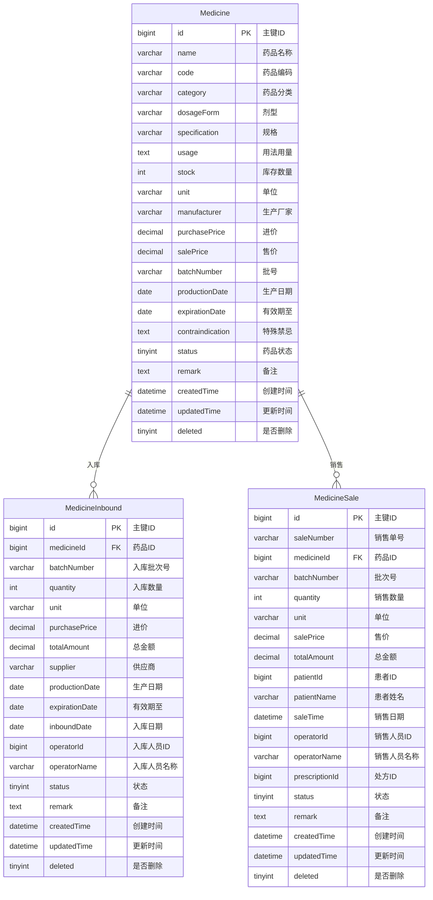

# 药品管理系统 ER 图与数据库设计

## ER 图

## 数据库设计说明

### 1. 实体关系说明

本系统包含三个主要实体：

1. **药品(Medicine)**：存储药品的基本信息
2. **药品入库(MedicineInbound)**：记录药品的入库信息
3. **药品销售(MedicineSale)**：记录药品的销售信息

药品与入库、销售之间是一对多的关系，即一种药品可以有多条入库记录和多条销售记录。

### 2. 表结构详细说明

#### 2.1 药品表(medicines)

存储系统中所有药品的基本信息。

| 字段名           | 类型          | 说明     | 约束               |
| ---------------- | ------------- | -------- | ------------------ |
| id               | BIGINT        | 主键 ID  | 主键、自增         |
| name             | VARCHAR(100)  | 药品名称 | 非空               |
| code             | VARCHAR(50)   | 药品编码 | -                  |
| category         | VARCHAR(50)   | 药品分类 | 非空               |
| dosage_form      | VARCHAR(50)   | 剂型     | -                  |
| specification    | VARCHAR(100)  | 规格     | -                  |
| usage            | TEXT          | 用法用量 | -                  |
| stock            | INT           | 库存数量 | 非空，默认 0       |
| unit             | VARCHAR(20)   | 单位     | -                  |
| manufacturer     | VARCHAR(100)  | 生产厂家 | -                  |
| purchase_price   | DECIMAL(10,2) | 进价     | 非空               |
| sale_price       | DECIMAL(10,2) | 售价     | 非空               |
| batch_number     | VARCHAR(50)   | 批号     | -                  |
| production_date  | DATE          | 生产日期 | -                  |
| expiration_date  | DATE          | 有效期至 | -                  |
| contraindication | TEXT          | 特殊禁忌 | -                  |
| status           | TINYINT       | 药品状态 | 非空，默认 1       |
| remark           | TEXT          | 备注     | -                  |
| created_time     | DATETIME      | 创建时间 | 非空，默认当前时间 |
| updated_time     | DATETIME      | 更新时间 | 非空，自动更新     |
| deleted          | TINYINT       | 是否删除 | 非空，默认 0       |

**索引**：

- 主键索引：id
- 普通索引：name, category, status

**药品状态说明**：

- 1: 正常
- 0: 禁用
- 2: 缺货
- 3: 即将过期
- 4: 已过期

**药品分类说明**：

- WESTERN_EXTERNAL: 西药外服
- WESTERN_INTERNAL: 西药内用
- WESTERN_INJECTION: 西药注射
- CHINESE_PATENT: 中成药
- CHINESE_HERBAL: 中药饮片
- PILL_POWDER: 丸散膏等

#### 2.2 药品入库表(medicine_inbounds)

记录药品的入库信息。

| 字段名          | 类型          | 说明         | 约束               |
| --------------- | ------------- | ------------ | ------------------ |
| id              | BIGINT        | 主键 ID      | 主键、自增         |
| medicine_id     | BIGINT        | 药品 ID      | 非空，外键         |
| batch_number    | VARCHAR(50)   | 入库批次号   | -                  |
| quantity        | INT           | 入库数量     | 非空               |
| unit            | VARCHAR(20)   | 单位         | -                  |
| purchase_price  | DECIMAL(10,2) | 进价         | 非空               |
| total_amount    | DECIMAL(10,2) | 总金额       | 非空               |
| supplier        | VARCHAR(100)  | 供应商       | -                  |
| production_date | DATE          | 生产日期     | -                  |
| expiration_date | DATE          | 有效期至     | -                  |
| inbound_date    | DATE          | 入库日期     | 非空               |
| operator_id     | BIGINT        | 入库人员 ID  | -                  |
| operator_name   | VARCHAR(50)   | 入库人员名称 | -                  |
| status          | TINYINT       | 状态         | 非空，默认 1       |
| remark          | TEXT          | 备注         | -                  |
| created_time    | DATETIME      | 创建时间     | 非空，默认当前时间 |
| updated_time    | DATETIME      | 更新时间     | 非空，自动更新     |
| deleted         | TINYINT       | 是否删除     | 非空，默认 0       |

**索引**：

- 主键索引：id
- 普通索引：medicine_id, inbound_date, batch_number

**状态说明**：

- 1: 正常
- 0: 已撤销

#### 2.3 药品销售表(medicine_sales)

记录药品的销售信息。

| 字段名          | 类型          | 说明         | 约束               |
| --------------- | ------------- | ------------ | ------------------ |
| id              | BIGINT        | 主键 ID      | 主键、自增         |
| sale_number     | VARCHAR(50)   | 销售单号     | 非空               |
| medicine_id     | BIGINT        | 药品 ID      | 非空，外键         |
| batch_number    | VARCHAR(50)   | 批次号       | -                  |
| quantity        | INT           | 销售数量     | 非空               |
| unit            | VARCHAR(20)   | 单位         | -                  |
| sale_price      | DECIMAL(10,2) | 售价         | 非空               |
| total_amount    | DECIMAL(10,2) | 总金额       | 非空               |
| patient_id      | BIGINT        | 患者 ID      | -                  |
| patient_name    | VARCHAR(50)   | 患者姓名     | -                  |
| sale_time       | DATETIME      | 销售日期     | 非空               |
| operator_id     | BIGINT        | 销售人员 ID  | -                  |
| operator_name   | VARCHAR(50)   | 销售人员名称 | -                  |
| prescription_id | BIGINT        | 处方 ID      | -                  |
| status          | TINYINT       | 状态         | 非空，默认 1       |
| remark          | TEXT          | 备注         | -                  |
| created_time    | DATETIME      | 创建时间     | 非空，默认当前时间 |
| updated_time    | DATETIME      | 更新时间     | 非空，自动更新     |
| deleted         | TINYINT       | 是否删除     | 非空，默认 0       |

**索引**：

- 主键索引：id
- 普通索引：medicine_id, sale_number, sale_time, patient_id

**状态说明**：

- 1: 正常
- 0: 已退货

### 3. 数据完整性约束

1. **实体完整性**：

   - 所有表都使用自增的 id 作为主键
   - 所有表都包含逻辑删除字段(deleted)

2. **参照完整性**：

   - medicine_inbounds.medicine_id 引用 medicines.id
   - medicine_sales.medicine_id 引用 medicines.id

3. **域完整性**：
   - 所有必填字段都设置了 NOT NULL 约束
   - 状态字段都有默认值和固定的取值范围

### 4. 业务规则

1. 药品入库后，系统自动更新对应药品的库存数量
2. 药品销售后，系统自动减少对应药品的库存数量
3. 药品状态会根据库存量和有效期自动更新
4. 药品销售时，需检查库存是否充足
5. 入库和销售记录支持逻辑删除，不进行物理删除

### 5. 数据字典

#### 药品分类(category)

- WESTERN_EXTERNAL: 西药外服
- WESTERN_INTERNAL: 西药内用
- WESTERN_INJECTION: 西药注射
- CHINESE_PATENT: 中成药
- CHINESE_HERBAL: 中药饮片
- PILL_POWDER: 丸散膏等

#### 药品状态(status)

- 1: 正常
- 0: 禁用
- 2: 缺货
- 3: 即将过期
- 4: 已过期

#### 入库/销售记录状态(status)

- 入库记录：1(正常), 0(已撤销)
- 销售记录：1(正常), 0(已退货)
